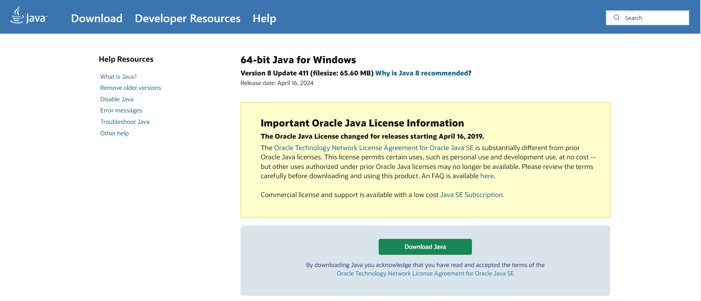
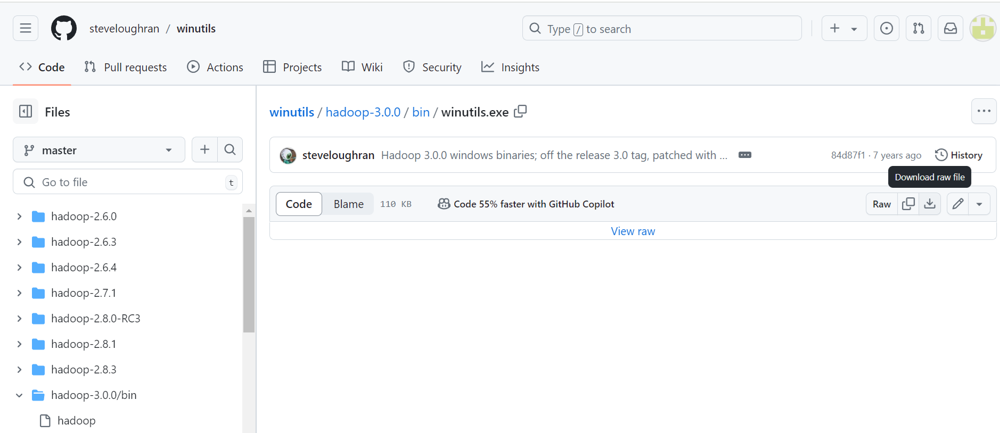
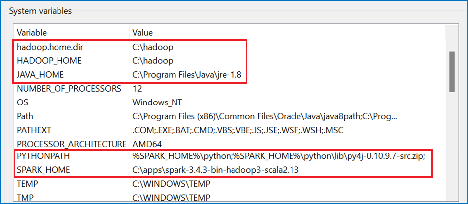
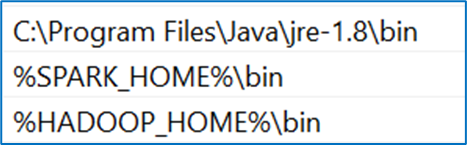
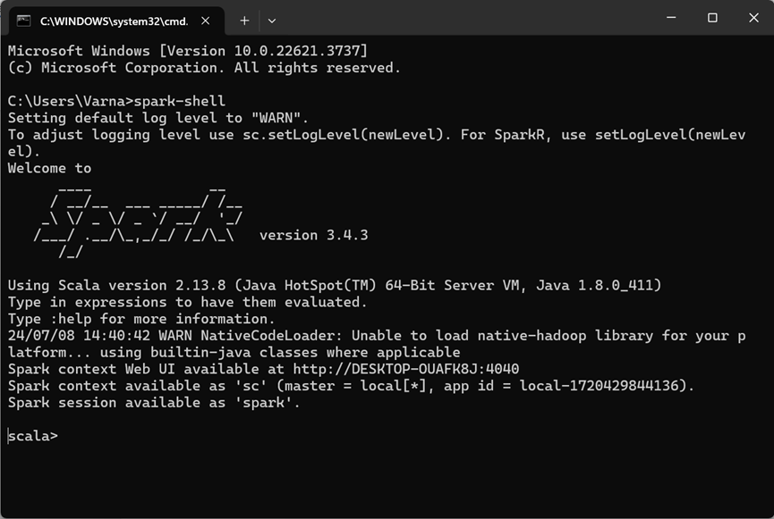

# Spark installation in windows

First, identify the Pyspark-Hadoop version you want to use in windows. 
Here I’m using, Pyspark v3.4.3 and Hadoop v3.0.0

> [!NOTE]
> Can’t say it’s the best way to run pyspark in Win because Linux is more compatible for java apps.

**_Steps:_**
1. Download 64-bit Java 8 for Win using [Java download page](https://www.java.com/en/download/). 
    1. Download and install the jre.
    2. Set system env variable for Java. 
       JAVA_HOME = <jre_path>

  > [!NOTE]
  > If you have any other jdk, uninstall it before installing the new one.
   
   
    
2. Download the Pyspark version from Apache site and select Pyspark v3.4.3 and Hadoop v3.0.0.  
   Refer [How to install pyspark on windows](https://sparkbyexamples.com/pyspark/how-to-install-and-run-pyspark-on-windows/).
    1. Extract the downloaded zip file.
    2. Move the extracted folder to C:\apps\ folder (Create ‘apps’ folder if C drive doesn’t have apps folder).
    3. Set system env variable for spark. 
    SPARK_HOME = C:\apps\spark-3.4.3-bin-hadoop3-scala2.13
3. Download Winutil.exe for Hadoop v3 from [Download winutil.exe for Hadoop](https://github.com/steveloughran/winutils/blob/master/hadoop-3.0.0/bin/winutils.exe). 
   Winutil.exe for other Hadoop versions are also available in the link above.
   
   
   
4. Copy the downloaded Winutil.exe to a C drive location.
    1. Create a folder named ‘hadoop’ in C drive.
    2. Create a ‘bin’ folder inside ‘hadoop’ folder.
    3. Copy the downloaded Winutil.exe into bin folder.
    4. Set env variable for Hadoop. 
    HADOOP_HOME = C:\hadoop 
    Hadoop.home.dir = C:\hadoop
5. System Env variables will look like this:
   
    

6. Path variable in System Env variables will look like:
    
    

7. Launch spark shell to check the set-up
    1. Open cmd.
    2. Type $ spark-shell
    3. Open spark web UI in http://localhost:4040/ to verify installation
    4. To close the shell, 
       $ System.exit(0)
       
      
      
      Spark shell would open up with out showing any errors.

### Now you are ready to do some big data processing.
